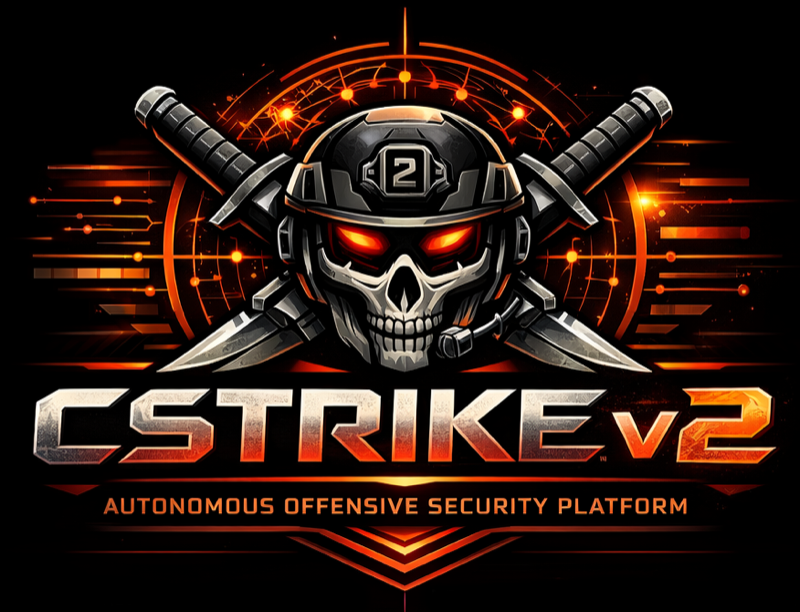

<p align="center">
  
</p>

<p align="center">
  <strong>Autonomous Offensive Security Platform</strong><br>
  <sub>9-container Docker stack | 35+ integrated tools | AI-driven 9-phase attack pipeline | VPN IP rotation</sub>
</p>

<p align="center">
  
</p>

<p align="center">
  <a href="#quick-start">Quick Start</a> |
  <a href="#downloads">Downloads</a> |
  <a href="#architecture">Architecture</a> |
  <a href="#web-ui">Web UI</a> |
  <a href="#tui-mode">TUI</a> |
  <a href="#api-reference">API</a> |
  <a href="#distribution">Distribution</a> |
  <a href="#documentation">Docs</a>
</p>

---

CStrike v2 is an autonomous offensive security platform built on a containerized Docker stack with a real-time web dashboard and AI-driven scan orchestration across 35+ integrated tools. Features a 9-phase attack pipeline (recon through exploitation), multi-provider AI reasoning (OpenAI, Anthropic, Ollama, Grok) with MCP tool server, nftables VPN kill switch across 5 providers (WireGuard, OpenVPN, Tailscale, NordVPN, Mullvad), automatic VPN IP rotation during scans via WireGuard config pool swapping, Metasploit RPC automation, and remote browser access via KasmVNC. Built for red team operations on isolated infrastructure with engagement lifecycle management, OPSEC gating, and emergency wipe capability.

Built for authorized red team engagements. Requires explicit scope authorization before use.

---

## Quick Start

> **Fastest path:** Download a [pre-built VM image](#downloads) — boot and go in 5 minutes. The instructions below are for Docker-only or source deployment.

```bash
# Clone
git clone https://github.com/culpur/cstrike.git
cd cstrike

# Configure
cp .env.example .env
# Edit .env — set POSTGRES_PASSWORD, REDIS_PASSWORD, KASM_PASSWORD

# Generate TLS certificates
bash docker/generate-certs.sh

# Start the stack
docker compose up -d

# Seed the database (first run only)
docker exec cstrike-api npx prisma db seed
```

| Access Point | URL |
|-------------|-----|
| HTTPS Dashboard | `https://localhost/` |
| Remote Browser (Kasm) | `https://localhost:6901/` |
| TUI | `docker exec -it cstrike-api python -m tui` |
| Health Check | `curl -sk https://localhost/health` |

> **Full install** from bare metal? Run `sudo bash install.sh` on Debian 12. See [Distribution](#distribution).

---

## Downloads

Pre-built VM images — boot and go, no building required.

#### amd64 (x86_64)

| Format | Use Case | Size | Download |
|--------|----------|------|----------|
| **QCOW2** | Proxmox / KVM / libvirt | ~14 GB | [Download](https://registry.culpur.net/dist/cstrikev2.5.1_amd64.qcow2) |
| **OVA** | VirtualBox / VMware | ~14 GB | [Download](https://registry.culpur.net/dist/cstrikev2.5.1_amd64.ova) |
| **VDI** | VirtualBox (native) | ~31 GB | [Download](https://registry.culpur.net/dist/cstrikev2.5.1_amd64.vdi) |

#### aarch64 (ARM64)

| Format | Use Case | Size | Download |
|--------|----------|------|----------|
| **QCOW2** | QEMU / UTM / Parallels | ~14 GB | [Download](https://registry.culpur.net/dist/cstrikev2.5.1_aarch64.qcow2) |
| **OVA** | VMware Fusion / UTM | ~14 GB | [Download](https://registry.culpur.net/dist/cstrikev2.5.1_aarch64.ova) |
| **VDI** | VirtualBox (native) | ~31 GB | [Download](https://registry.culpur.net/dist/cstrikev2.5.1_aarch64.vdi) |

[BitTorrent downloads](docs/DISTRIBUTION.md#bittorrent-recommended-for-large-files) | [Checksums](https://registry.culpur.net/dist/checksums.sha256) | [All formats](docs/DISTRIBUTION.md)

> Pre-built images include Debian 12 + 35+ security tools + Docker stack. First boot auto-expands disk, regenerates SSH keys, randomizes passwords, and starts all services.

---

## Architecture

```
                          ┌─────────────────────────────────────┐
                          │   Traefik v3.3 Reverse Proxy         │
                          │   :80 (redirect) → :443 (HTTPS)      │
                          └─────────────┬───────────────────────┘
                     ┌──────────────────┼──────────────────┐
                     │                  │                  │
              /api/* + /socket.io/*     │           /* (catch-all)
                     │                  │                  │
          ┌──────────▼──────────┐       │      ┌───────────▼──────────┐
          │  Express 5 API       │       │      │  React 19 Frontend    │
          │  :3001               │       │      │  :3000                │
          │  TypeScript + Prisma │       │      │  Vite 7 + Tailwind 4  │
          └────┬───────────┬────┘       │      └──────────────────────┘
               │           │            │
        ┌──────▼──┐  ┌─────▼─────┐      │      ┌─────────────────────┐
        │ PG 16   │  │ Redis 7   │      │      │  KasmVNC :6901       │
        │ :5432   │  │ :6379     │      │      │  Remote Chrome       │
        └─────────┘  └───────────┘      │      │  (bridge network)    │
                                        │      └─────────────────────┘
          ┌─────────────────────────────┘
          │  Host bind mounts (read-only)
          │  /usr/bin, /usr/local/bin, /opt → 35+ security tools
          │  nmap, nuclei, ffuf, hydra, sqlmap, impacket, ...
          │
          │  ┌────────────┐  ┌────────────┐  ┌────────────┐
          │  │ ZAP :8080  │  │ MSF :55553 │  │VulnBox:8888│
          │  │ OWASP DAST │  │ Metasploit │  │ 30+ vulns  │
          │  └────────────┘  └────────────┘  └────────────┘
```

All containers use `network_mode: host` for direct access to host tools and VPN interfaces, except Kasm which uses bridge networking with port mapping.

---

## Prerequisites

| Dependency | Version | Purpose |
|-----------|---------|---------|
| Docker Engine | 24+ | Container runtime |
| Docker Compose | v2 (plugin) | Stack orchestration |
| Debian 12 | Bookworm | Host OS (recommended) |

**Hardware:** 4 CPU cores, 8 GB RAM, 50 GB disk minimum.

**Host tools:** The API container executes security tools via bind-mounted host directories. Without tools installed on the host, scans will fail. Run `scripts/vm/provision-host.sh` for full installation, or see [Bare Metal Install](docs/BARE_METAL_INSTALL.md).

---

## Docker Stack

| Container | Image | Port | Purpose |
|-----------|-------|------|---------|
| `cstrike-postgres` | `postgres:16-alpine` | 5432 | Primary database (10 models, Prisma ORM) |
| `cstrike-redis` | `redis:7-alpine` | 6379 | LRU cache + AOF persistence |
| `cstrike-api` | Custom (Node 22 + Python 3.12) | 3001 | REST API + WebSocket + MCP server |
| `cstrike-frontend` | Custom (Node 22 Alpine) | 3000 | React web dashboard (served by `serve@14`) |
| `cstrike-traefik` | `traefik:v3.3` | 80, 443 | TLS reverse proxy, security headers, rate limiting |
| `cstrike-kasm` | `kasmweb/chrome:1.16.0` | 6901 | Remote browser session (KasmVNC) |
| `cstrike-zap` | `zaproxy/zap-stable` | 8080 | OWASP ZAP daemon (web scanning) |
| `cstrike-metasploit` | `metasploitframework/metasploit-framework` | 55553 | Metasploit RPC (exploit framework) |
| `cstrike-vulnbox` | Custom (Debian Bookworm) | 8888 | Deliberately vulnerable target (30+ vulns) |

Named volumes: `pgdata`, `redisdata`, `apidata`, `vulnbox-db`.

---

## Workflow

CStrike executes a 9-phase pipeline per target. Each phase feeds results forward.

| # | Phase | Modules | Output |
|---|-------|---------|--------|
| 1 | **Reconnaissance** | nmap, dig, amass, subfinder, httpx, nikto, wafw00f, whatweb, dnsrecon | Port map, subdomains, tech stack, headers |
| 2 | **AI Analysis** | OpenAI / Anthropic / Ollama / Grok | Suggested commands, attack vectors |
| 3 | **Web Scanning** | OWASP ZAP, Burp Suite | Web vulnerabilities, injection points |
| 4 | **Web Exploitation** | nuclei, ffuf, sqlmap, hydra | CVEs, directory findings, SQLi, brute-force |
| 5 | **API Security** | VulnAPI (discover, curl, openapi) | API endpoints, OWASP API Top 10 findings |
| 6 | **Metasploit** | msfrpcd RPC | Exploit sessions, post-exploitation data |
| 7 | **Exploitation Chains** | Auto-chained from phases 2-6 | Credential reuse, lateral movement |
| 8 | **AI Follow-up** | OpenAI / Anthropic / Ollama / Grok | Pivot suggestions, missed vectors |
| 9 | **Reporting** | loot_tracker, results compiler | JSON results, loot summary, credentials |

---

## Web UI

The frontend is a React 19 / TypeScript / Tailwind CSS 4 application with a dark theme and 9 view modules.

| Module | Description |
|--------|-------------|
| **Command Center** | System metrics (CPU, RAM, VPN IP, network IPs), service status, scan launcher, AI feed |
| **Services** | Service health panel (API, Metasploit, ZAP, Burp) |
| **Targets** | Add/manage targets, launch scans, view per-target results |
| **AI Stream** | Real-time AI thought stream and command decisions |
| **Exploitation** | Web vuln exploitation controls, brute-force configuration |
| **Loot** | Credential tracker with sensitivity heatmaps and export |
| **Results** | Scan results browser with severity filtering |
| **Logs** | Streaming log viewer with level filtering |
| **Configuration** | AI provider selection, scan modes, tool allowlist, service connections, VPN rotation |
| **Battle Map** | Attack visualization with scan progress, tool execution, VPN rotation IP tracking |

### WebSocket Events

Real-time updates via Socket.IO:

| Event | Payload |
|-------|---------|
| `system_metrics` | CPU %, memory %, VPN IP, uptime, network IPs, service health |
| `recon_output` | Tool name, target, output, completion status |
| `ai_thought` | Thought type, content, command |
| `ai_command_execution` | Command, status, output |
| `phase_change` | Phase name, target, status |
| `scan_complete` | Target, scan ID, stats |
| `exploit_started` | Target |
| `exploit_result` | Vulnerability, severity, target |
| `exploit_completed` | Target |
| `loot_item` | Category, value, source, target |
| `vulnapi_output` | Target, findings |
| `log_entry` | Level, source, message |
| `status_update` | Metrics, services, phase |
| `service_auto_start` | Service name, status |
| `vpn_rotation` | Config file, provider, old/new IP, duration, success |

---

## TUI Mode

The Textual-based terminal UI runs inside the API container:

```bash
docker exec -it cstrike-api python -m tui
```

| Key | Action |
|-----|--------|
| `3` | Toggle live log viewer |
| `4` | Start Metasploit RPC, ZAP, Burp |
| `5` | Stop all services |
| `f` | Filter logs (ERROR/WARN) |
| `q` | Quit |

---

## Configuration

CStrike uses a two-tier configuration model:

### Infrastructure (`.env` file)

Controls Docker container settings. Edit before `docker compose up`:

| Variable | Description | Default |
|----------|-------------|---------|
| `POSTGRES_PASSWORD` | PostgreSQL password | `changeme` |
| `REDIS_PASSWORD` | Redis password | `changeme` |
| `KASM_PASSWORD` | KasmVNC remote browser password | `CStr1k3!` |
| `CORS_ORIGINS` | Allowed API origins | `http://localhost:3000,...` |
| `LOG_LEVEL` | API log verbosity | `info` |

### Operational (Web UI / REST API)

AI providers, scan modes, target scope, and tool allowlists are stored in the PostgreSQL `ConfigEntry` table and managed via the Configuration module or `/api/v1/config` endpoints:

| Setting | Options |
|---------|---------|
| AI Provider | OpenAI (GPT-4o/5), Anthropic (Claude), Ollama (local), Grok |
| Scan Modes | port, http, dirbusting, dns, subdomain, osint, vulnscan, apiscan, web_exploit, smb, ldap, snmp, network, ssl, password, cloud |
| Tool Allowlist | 60+ tools individually toggleable |
| Target Scope | Authorized domains/IPs |
| Exploitation Gate | Enable/disable active exploitation |

---

## API Reference

The Express 5 API server exposes 14 route groups under `/api/v1/` with Zod request validation, rate limiting (100 req/min per IP), and Helmet security headers.

### Scan Control

| Method | Endpoint | Description |
|--------|----------|-------------|
| POST | `/api/v1/recon/start` | Start scan for a target |
| GET | `/api/v1/recon/status/:id` | Scan status by ID |
| GET | `/api/v1/recon/active` | List active scans |
| POST | `/api/v1/recon/batch` | Start batch scan (up to 10 targets) |
| DELETE | `/api/v1/recon/scans/:id` | Cancel a scan |

### Targets & Results

| Method | Endpoint | Description |
|--------|----------|-------------|
| GET | `/api/v1/targets` | List all targets |
| POST | `/api/v1/targets` | Add a target |
| GET | `/api/v1/results` | Query scan results |
| GET | `/api/v1/loot` | Loot items (credentials, vulns) |
| GET | `/api/v1/loot/credentials` | Credential pairs with scoring |

### AI & Exploitation

| Method | Endpoint | Description |
|--------|----------|-------------|
| POST | `/api/v1/ai/analyze` | Trigger AI analysis |
| GET | `/api/v1/ai/thoughts` | AI thought stream |
| PUT | `/api/v1/ai/provider` | Switch AI provider |
| POST | `/api/v1/exploit/start` | Start exploitation |
| POST | `/api/v1/exploit/bruteforce` | Brute-force attack |

### Services & System

| Method | Endpoint | Description |
|--------|----------|-------------|
| GET | `/api/v1/status` | System metrics (CPU, RAM, VPN, network IPs, uptime) |
| GET | `/api/v1/services` | Service health states |
| GET | `/api/v1/config` | Read configuration entries |
| PUT | `/api/v1/config` | Update configuration |
| GET | `/api/v1/logs` | Query log entries |

### Integrations

| Method | Endpoint | Description |
|--------|----------|-------------|
| POST | `/api/v1/vulnapi/scan` | Start VulnAPI DAST scan |
| GET | `/api/v1/vulnapi/results/:target` | VulnAPI results |
| GET | `/api/v1/mcp/tools` | List MCP tools |
| POST | `/api/v1/mcp/tools/:name` | Execute MCP tool |
| GET | `/api/v1/vpn` | VPN connection status |
| POST | `/api/v1/vpn/:provider/connect` | Connect VPN provider |
| GET | `/api/v1/vpn/rotation/config` | VPN rotation configuration |
| PUT | `/api/v1/vpn/rotation/config` | Update rotation config |
| POST | `/api/v1/vpn/rotation/generate/nordvpn` | Generate NordVPN WireGuard configs |
| POST | `/api/v1/vpn/rotation/generate/mullvad` | Generate Mullvad WireGuard configs |
| GET | `/api/v1/vpn/rotation/pool` | List available rotation configs |
| GET | `/api/v1/vpn/rotation/history/:scanId` | Rotation history for a scan |

### Health

| Method | Endpoint | Description |
|--------|----------|-------------|
| GET | `/health` | Database + Redis health check (200/503) |

---

## Project Structure

```
cstrike/
├── api/                            # Express 5 + TypeScript API
│   ├── src/
│   │   ├── server.ts               # Entry point — Express + Socket.IO
│   │   ├── config/                 # env, database, redis
│   │   ├── routes/                 # 14 route modules
│   │   ├── services/               # AI, metrics, scans, tools, VPN, VPN rotation, MCP
│   │   ├── middleware/             # guardrails, rate limiter, validation
│   │   ├── schemas/                # Zod request validation
│   │   ├── utils/                  # credential scoring, safe paths
│   │   └── websocket/             # Socket.IO setup + typed emitter
│   └── prisma/
│       ├── schema.prisma           # 10 models, PostgreSQL 16
│       └── seed.ts                 # Database seeder
│
├── web/                            # React 19 + TypeScript + Tailwind 4
│   ├── src/
│   │   ├── modules/               # 9 view modules (dashboard, targets, ai, ...)
│   │   ├── components/            # Shared UI components
│   │   ├── services/              # API client + WebSocket
│   │   ├── stores/                # 7 Zustand state stores
│   │   └── types/                 # TypeScript interfaces
│   └── package.json
│
├── mcp_server/                     # Python MCP tool server (16 categories)
│   ├── tools/                     # recon, web_exploit, metasploit, credentials, ...
│   ├── guardrails.py              # Scope + tool + exploitation validation
│   └── config.py                  # JSON config loader
│
├── tui/                            # Textual terminal UI
│   ├── app.py                     # Main TUI app
│   ├── screens/                   # dashboard, startup
│   └── widgets/                   # ai_thoughts, log_viewer, loot_summary, ...
│
├── modules/                        # Python scan modules (recon, exploit, AI, loot)
├── docker/
│   ├── Dockerfile.api             # Multi-stage Node 22 + Python 3.12
│   ├── Dockerfile.frontend        # Multi-stage Node 22 + serve@14
│   ├── traefik/dynamic.yml        # Traefik routing + security headers
│   ├── certs/                     # TLS certificates (generated)
│   └── generate-certs.sh          # Self-signed cert generator
│
├── scripts/vm/                     # VM provisioning & distribution
│   ├── provision-host.sh          # 7-step host setup (Kali tools, Go, Docker)
│   ├── harden-host.sh             # Security hardening (SSH, PAM, auditd, fail2ban)
│   ├── setup-redteam.sh           # Redteam user + VPN routing
│   ├── create-vm.sh               # Proxmox API VM creation
│   ├── export-ova.sh              # VirtualBox OVA export
│   ├── package-vm.sh              # VM packaging & distribution builder
│   ├── cstrike-firstboot.sh       # First-boot auto-setup (partition, SSH, passwords)
│   ├── cstrike-v2.ovf             # OVF descriptor for OVA packaging
│   ├── cloud-init.yml             # Proxmox cloud-init
│   └── cloud-init-generic.yml     # Generic cloud-init (AWS/GCP/Azure/DO)
│
├── docker-compose.yml              # 9-container Docker stack
├── docker-compose.arm64.yml        # ARM64 overrides (chromium instead of Kasm)
├── install.sh                      # Master bare-metal installer
├── .env.example                    # Infrastructure secrets template
├── results/                        # Per-target scan output (JSON)
└── data/                           # Agent registry, runtime data
```

---

## Security Tools

35+ tools accessible from the API container via host bind mounts:

| Category | Tools |
|----------|-------|
| Port Scanning | nmap, masscan, rustscan |
| Web Recon | nikto, whatweb, wafw00f, httpx, gowitness |
| Subdomain Enumeration | subfinder, amass, dnsrecon, dnsenum |
| Directory Fuzzing | ffuf, gobuster, feroxbuster, dirb, wfuzz |
| Vulnerability Scanning | nuclei, sqlmap, xsstrike, commix |
| Credential Attacks | hydra, john, hashcat, cewl |
| Network Enumeration | enum4linux, smbclient, ldapsearch, snmpwalk, rpcclient |
| SSL/TLS Analysis | testssl.sh, sslscan, sslyze |
| Post-Exploitation | impacket (secretsdump, psexec, wmiexec), chisel, bloodhound |
| Container Security | trivy, kube-hunter |
| OSINT | theHarvester, sherlock, gau, waybackurls |
| Exploitation Frameworks | Metasploit (msfrpcd RPC), OWASP ZAP |

---

## VPN & OPSEC

CStrike supports 5 VPN providers with nftables kill switch enforcement:

| Provider | Interface | Kill Switch |
|----------|-----------|-------------|
| WireGuard | `wg0` | nftables DROP on tunnel down |
| OpenVPN | `tun0` | nftables DROP on tunnel down |
| Tailscale | `tailscale0` | Management overlay |
| NordVPN | `nordlynx` | Mullvad-style lockdown |
| Mullvad | `wg-mullvad` | Built-in lockdown mode |

**Split routing:** The `redteam` user's traffic is marked with iptables fwmark and routed through a dedicated VPN tunnel. Management traffic (SSH, web UI) stays on the primary interface.

**VPN IP Rotation:** During scans, CStrike can automatically rotate VPN exit IPs between tool executions to obfuscate scanning origin. Pre-generates WireGuard config pools from NordVPN (via `nordgen`) or Mullvad (native relay API), then swaps `wg-quick` configs (~5-10s per rotation). Three strategies: `per-tool` (every tool), `periodic` (every N tools, default 3), and `phase-based` (on phase change). Configured via the web UI Configuration tab or `/api/v1/vpn/rotation/` endpoints.

**OPSEC gating:** All scans enforce target scope validation and tool allowlist checks at both the API middleware layer and the MCP server guardrails.

---

## Distribution

CStrike v2 ships in 7 formats. See [docs/DISTRIBUTION.md](docs/DISTRIBUTION.md) for details and downloads.

| Format | Setup Time | Command |
|--------|:----------:|---------|
| **Pre-built VM** (QCOW2/OVA/VDI/VMDK) | ~5 min | [Download](#downloads) → import → boot |
| **Docker Compose** | ~10 min | `docker compose up -d` |
| **Bare Metal** | ~45 min | `sudo bash install.sh` |
| **Cloud-Init** (AWS/GCP/Azure/DO) | ~30 min | User data: `scripts/vm/cloud-init-generic.yml` |
| **Proxmox (Fresh)** | ~20 min | `scripts/vm/create-vm.sh` + `install.sh` |

---

## Documentation

| Document | Description |
|----------|-------------|
| [Distribution Guide](docs/DISTRIBUTION.md) | Deployment formats, pre-built VM downloads, BitTorrent |
| [Docker Deployment](docs/DOCKER_DEPLOYMENT.md) | Docker-only deployment guide |
| [Bare Metal Install](docs/BARE_METAL_INSTALL.md) | Full Debian 12 → CStrike walkthrough |
| [Web UI README](web/README.md) | Frontend architecture and development |
| [v2 Changelog](v2-changelog.md) | Full change history from v1 to v2.5 |
| [VulnBox](https://github.com/culpur/vulnbox) | Deliberately vulnerable target container (standalone repo) |

---

## Legal

This software is intended **exclusively for authorized penetration testing** and red team operations. You must have explicit written authorization before scanning or testing any target. Unauthorized access to computer systems is illegal under the Computer Fraud and Abuse Act (CFAA) and equivalent laws in other jurisdictions.

The authors assume no liability for misuse.

---

## License

MIT License (c) 2025-2026 Culpur Defense Inc.

---

<p align="center">
  Built by <a href="https://culpur.net">Culpur Defense Inc.</a><br>
  <a href="https://github.com/culpur">GitHub</a>
</p>
